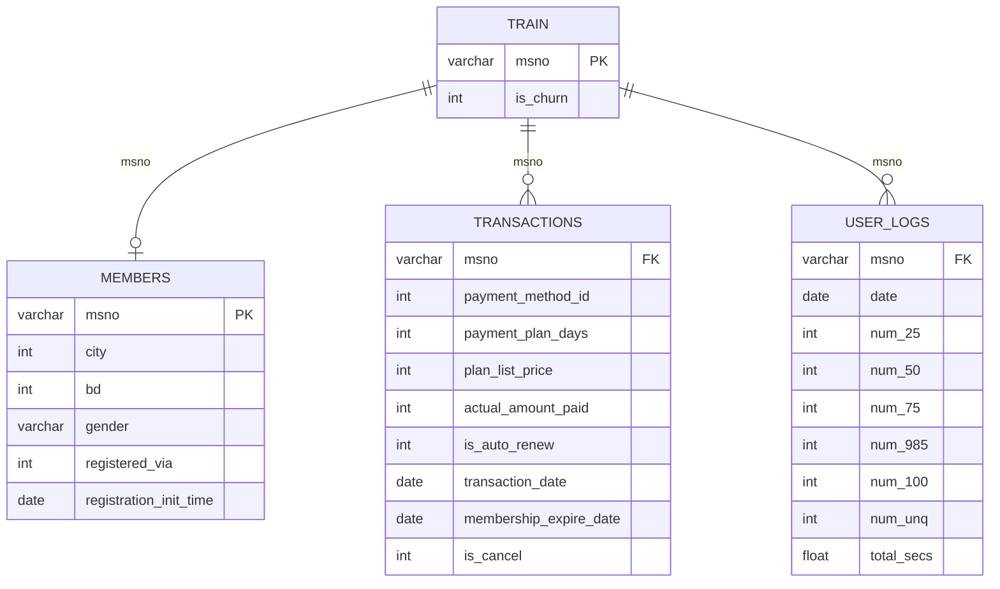

# KKBox Subscriber Behaviour & Retention Analysis

## Project Background

KKBox is Taiwan's leading music streaming service, founded in 2004 and now operating across Taiwan, Hong Kong, Japan, Malaysia and Singapore. It runs on a subscription model: most subscribers pay monthly by credit card, while longer plans of 90 to 410 days are bought as one-time payments at convenience stores or through mobile network deals.

As a data analyst on the retention team, I analysed the 970,960 subscribers whose memberships expired in March 2017, a cohort with an **8.99% churn rate**. The goal was to find what separates subscribers who churn from those who stay, and what the business can change to keep more of them.

Insights and recommendations are provided on the following key areas:

**Listening Behaviour:** Churners use the app the same way stayers do. Skip rate (19.19% vs 19.21%), listening time and engagement level all differ by **less than 4 percentage points**. Engagement metrics should not be used as the retention team's early-warning signal for churn.

**Payment and Renewal:** Manual renewers churn at **30.57%**, compared with **3.83%** for auto-renew subscribers, an **8x gap** that holds even among subscribers who actively listen. KKBox is losing engaged users at the renewal step, so moving subscribers onto auto-renew is the most direct lever on churn.

**Plan Structure:** Auto-renew only exists on monthly plans. Not one of **162,451 longer-plan transactions** was on auto-renew, and those subscribers churn at **90% to 99%**. Offering auto-renew on quarterly and long-term plans closes a gap that comes from how the product is built, not from what subscribers want.

**Revenue Opportunity and Tracking:** Under a conservative scenario, auto-renew on longer plans could retain an estimated **15,000+ subscribers** and recover **over $700K a year**. Three metrics would track whether a test delivers it: auto-renew adoption on longer plans (currently 0%), churn on longer plans (currently 90% to 99%, against a conservative target of 11.95%), and auto-renew conversion among the 64,713 manual monthly subscribers.

The SQL queries used to inspect and clean the data for this analysis can be found here: [01_setup_and_cleaning.sql](sql/01_setup_and_cleaning.sql) and [02_data_quality_checks.sql](sql/02_data_quality_checks.sql).

Targeted SQL queries regarding various business questions can be found here: [03_user_level_table.sql](sql/03_user_level_table.sql) and [04_analysis.sql](sql/04_analysis.sql).

An interactive Tableau story used to report the findings can be found here: [ADD TABLEAU PUBLIC LINK].

---

## Data Structure & Initial Checks

The company's main database structure, as seen below, consists of four tables: `train`, `members`, `transactions` and `user_logs`, with a total row count of roughly 419 million records. The data comes from the [KKBox Churn Prediction Challenge](https://www.kaggle.com/competitions/kkbox-churn-prediction-challenge) on Kaggle and is not stored in this repo because of its size (~10GB). A description of each table is as follows:

- **`train` (970,960 rows):** One row per subscriber in the March 2017 expiry cohort, with a flag showing whether they churned.
- **`members` (6.77M rows):** Subscriber profile: registration date, registration method, city, age and gender.
- **`transactions` (1.4M rows):** Payment history: plan length, list price, amount paid, auto-renew status, transaction date, expiry date and cancellations.
- **`user_logs` (~410M rows):** Daily listening activity from January 2015 to March 2017: songs played grouped by how far through they were played, unique songs, and total listening time.

Before the analysis, I cleaned each table and checked which subscribers could be analysed. Registration dates were stored as millisecond timestamps rather than the documented date format and were converted. Two-thirds of ages were invalid and were set to null rather than guessed. I then built a one-row-per-subscriber table that measures each person's activity against the days they were actually a member between January and March 2017, so someone who joined in February is not compared against a full quarter.

---

## Executive Summary

### Overview of Findings

For the Head of Product: **how subscribers pay predicts churn far more than how they use the app.** Manual renewers churn at 8x the rate of auto-renew subscribers (30.57% vs 3.83%), while every listening measure separates churners from stayers by less than 4 percentage points. The gap comes from the product itself: auto-renew only exists on monthly plans, so subscribers on longer plans churn at 90% to 99%. Enabling auto-renew on those plans could recover an estimated **$700K+ in annual revenue** under conservative assumptions.

[Visualization: snapshot of the Tableau story, `visuals/overview.png`]

---

## Insights Deep Dive

### Listening Behaviour

- **Churners skip songs at the same rate as stayers.** Across January to March 2017, the average skip rate (songs played less than 25% through) was 19.19% for stayers and 19.21% for churners. Within a listening session, the two groups behave the same.

- **Churners listen just as long on the days they listen.** The median listening time on an active day was 83 minutes for stayers and 88 minutes for churners. Over the full quarter, total listening time differed by only about 5.5% (6,364 vs 6,026 minutes).

- **Churners are not less engaged.** Measured against the days they were actually members, churners were active on 54.3% of their days, compared with 50.4% for stayers. If anything, churners were slightly more active.

- **Engagement level barely changes churn.** Grouped into Dormant (no active days), Light (active on under half their membership days) and Regular users, churn was 6.96%, 5.58% and 7.14%. The spread is under 2 percentage points, so usage is not a useful early-warning signal.

[Visualization: `visuals/listening_behaviour.png`]

### Payment and Renewal

- **Manual renewal is where subscribers are lost.** Based on each subscriber's latest transaction before 31 March 2017, manual renewers churned at 30.57% (82,894 users) and auto-renew subscribers at 3.83% (850,684 users): an 8x gap, and a 27-point difference against under 4 points for any usage measure.

- **The gap holds even among engaged users.** Among subscribers who listened during the quarter, manual renewers still churned at 30.41%, against 3.55% for auto-renew. Keeping usage the same, the renewal method alone moves churn by almost 9x.

- **Auto-renew keeps subscribers who never listen.** 172,397 subscribers never opened the app between January and March but stayed on auto-renew, and they churned at only 4.92%, below the 8.99% overall rate. This is passive renewal: the payment carries on without any engagement.

- **Without auto-renew, non-listeners almost all leave.** The 209 subscribers who didn't listen and renewed manually churned at 93.78%. The group is small, but it shows the same pattern at its most extreme.

[Visualization: `visuals/payment_renewal.png`]

### Plan Structure

- **Longer plans churn more, not less.** Monthly auto-renew subscribers churned at 3.83% and monthly manual subscribers at 11.95%, while quarterly subscribers churned at 90.42% (4,208 users) and long-term subscribers at 99.26% (13,498 users).

- **Auto-renew does not exist beyond monthly plans.** Across the full transaction history, there were 162,451 transactions on plans of 90 to 410 days, and not one was set to auto-renew. On the 30-day plan, 1.12 million of 1.22 million transactions were.

- **This is a product constraint, not a subscriber choice.** In 2017, monthly plans were charged to a credit card each month, which is what made auto-renew possible. Longer plans were usually bought at convenience stores or through mobile network deals as one-time payments, so there was no card on file to charge again. When the plan ends, nothing carries the subscriber into the next period. Subscribers who commit the most up front are the ones the renewal system can't keep.

- **Manual renewal alone doesn't explain the size of the gap.** Monthly manual renewers churn at 11.95%, far below the 90%+ on longer plans. Longer-plan subscribers have to make an active decision, with no default to fall back on, after a long gap since they last paid.

[Visualization: `visuals/plan_structure.png`]

### Revenue Opportunity

- **I sized the opportunity with two scenarios.** Monthly subscribers are the only group with auto-renew, so they served as the benchmark. The optimistic scenario assumes longer-plan subscribers would churn at the monthly auto-renew rate (3.83%). The conservative scenario assumes they would churn at the monthly manual rate (11.95%), meaning only the friction part of the gap can be recovered.

- **Conservative estimate: 15,087 subscribers retained and $727,344 a year.** Of this, 11,785 subscribers and $569,633 come from long-term plans, and 3,302 subscribers and $157,712 from quarterly plans.

- **Optimistic estimate: 16,525 subscribers retained and $796,641 a year.** The two scenarios are close together because churn on longer plans is so high that most of it is recoverable either way.

- **Long-term plans hold most of the value.** Once annualised, a subscriber is worth about $48 a year on either plan type. Long-term plans matter more because they have over 3x as many subscribers and churn almost completely.

| Scenario | Subscribers retained | Annual revenue recovered |
|---|---|---|
| Conservative | 15,087 | $727,344 |
| Optimistic | 16,525 | $796,641 |

[Visualization: `visuals/revenue_opportunity.png`]

---

## KPIs & Recommendations

Based on the insights and findings above, we would recommend the **Product and Retention teams** consider the following:

### 1. Offer Auto-Renew on Longer Plans, Starting with Long-Term

Subscribers on plans longer than 30 days churn at 90% to 99% because they have no way to auto-renew. The recommendation is to **add a recurring card payment option at purchase for long-term plans (13,498 subscribers, 99.26% churn)**, then extend it to **quarterly plans (4,208 subscribers, 90.42% churn)**. Long-term plans come first because they hold most of the opportunity: an estimated **$569,633 a year** under the conservative scenario, against **$157,712** for quarterly plans. For subscribers who keep paying at convenience stores or through network deals, add renewal reminders before the plan expires and an in-app option to switch to a recurring plan.

### 2. Test the Change and Track Three KPIs

The revenue estimates are scenarios, not guaranteed outcomes, so the change should be **rolled out to a test group of longer-plan subscribers and measured against a control group** before going live for everyone. Three KPIs would show whether it is working:

- **Auto-renew adoption on longer plans:** currently 0%, the first sign that subscribers are taking up the option.
- **Churn on longer plans:** currently 90% to 99%, with the monthly manual rate (11.95%) as the conservative target and the monthly auto-renew rate (3.83%) as the best case.
- **Manual-to-auto conversion on monthly plans:** the share of manual monthly subscribers who switch to auto-renew.

### 3. Convert Manual Monthly Subscribers to Auto-Renew

Even on monthly plans, where auto-renew already exists, the **64,713 subscribers who renew manually churn at 11.95%, more than 3x the 3.83% rate for auto-renew subscribers**. The recommendation is to **prompt manual monthly subscribers to switch to auto-renew**, for example at the point of renewal or after a period of regular listening. Closing that gap would keep an estimated **5,250 more subscribers**, without any change to how plans are built.

---

## Assumptions and Caveats

Throughout the analysis, multiple assumptions were made to manage challenges with the data. These assumptions and caveats are noted below:

- **The auto-renew gap is an association, not proven causation.** Subscribers who choose auto-renew may already intend to stay. The revenue figures are scenario-based estimates, and only a controlled test can confirm the real effect.

- **Around 145,000 subscribers could not be included in the usage-rate analysis.** Measuring activity against membership days needs both a member record and a transaction. Subscribers missing a transaction record churned at 77.73%, so the analysed group (825,367 users) churns at 6.51%, below the overall 8.99%. Findings are compared between segments, not read as KKBox's overall churn level.

- **Revenue is converted at NT$30 to US$1 and annualised per subscriber.** The annual figures assume a retained subscriber stays for a full year.
